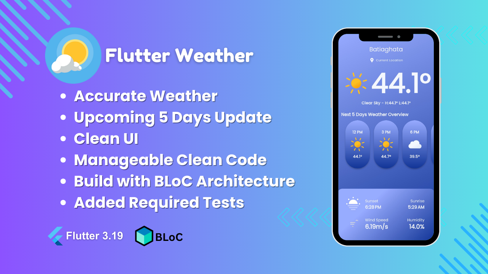
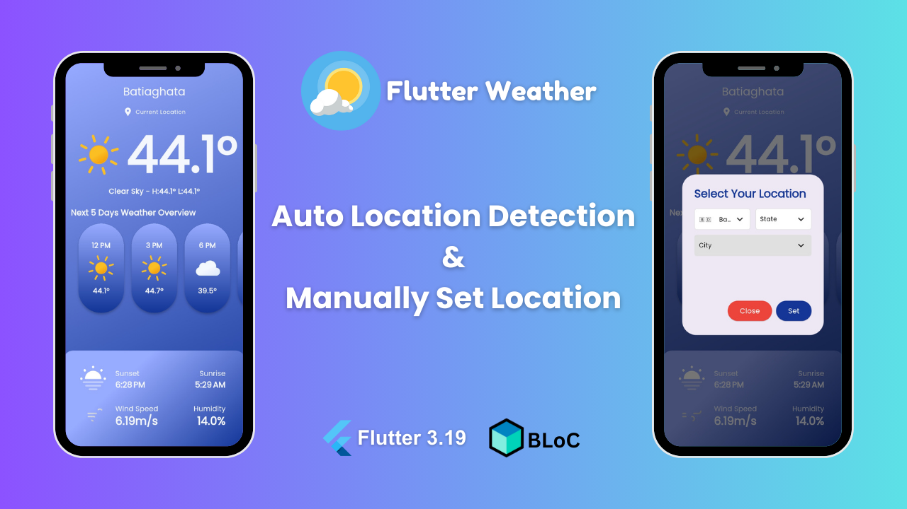

# Flutter Weather

Flutter Weather is a comprehensive weather application designed to provide users with accurate and up-to-date weather forecasts and information. The app aims to offer a seamless user experience with intuitive design and features that cater to both casual users and weather enthusiasts. Flutter Weather will fetch data from reliable weather sources and utilize advanced algorithms to present users with personalized forecasts based on their location and preferences.


## Screenshots




## APK
#[Download APK From Where](https://drive.google.com/file/d/16mDRNyDRlXrRDn_HTPu-zKTYlr8Z8X1L/view?usp=sharing)

## Documentation


1. Clone this repository with this command

```git clone https://github.com/Mahamudul-Dev/flutter_weather_app.git```

2. Run `flutter pub get` command for install all required packages.
3. Change OPEN_WEATHER_APP_ID from `lib/data/utils/config.dart`. You can achive API key from [Open Weather](https://openweathermap.org/api)

4. Now you can build apk via running `flutter build apk`
## 🚀 About Me
I'm a full stack flutter app developer with 2 years of working experience in freelance marketplace. Now I am looking for a team or organization for contribute with my skills...


## 🛠 Skills
Flutter, Dart, Dart Shelf, GetX, BLoC, Kotlin, NodeJS, Python FastAPI...

